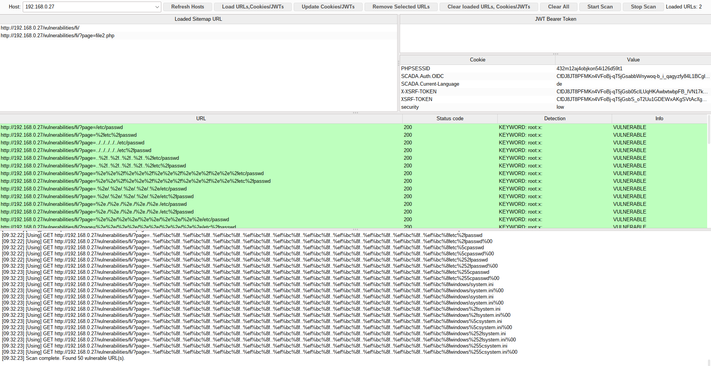

<div align="center">

# PathWalker LFI Scanner


</div>

PathWalker is a Burp Suite Montoya extension for finding Local File Inclusion (LFI) and path traversal issues from URLs already discovered in Burp.

<p align="center">
  
</p>

---

## Unique Use Case

PathWalker automates sitemap-driven LFI and path traversal testing. It walks backwards from each directory level of discovered URL paths and injects traversal payloads from every path context, rather than only testing the final endpoint. This helps find routing and rewrite-layer traversal issues that can be missed when only the final endpoint or visible GET parameters are tested. It also tests GET parameters with direct file and traversal payload variants.

PathWalker can load target URLs from Burp's sitemap. To support authenticated testing, it allows you to reuse session cookies and JWT Bearer tokens already observed in Burp Proxy history. The extension also reports high-confidence findings back into Burp's Target sitemap.

---

## Features

* **Dedicated scanning UI:** Select a host, review sitemap URLs, edit session material, and launch on-demand scans from the PathWalker tab.
* **Directory-aware path walking:** Starts from each discovered endpoint and walks up through every parent directory, injecting traversal payloads at each path level while de-duplicating equivalent requests.
* **GET-parameter testing:** Replaces GET parameter values with direct file and traversal payload variants.
* **Payload generation:** Covers common Linux and Windows target files with URL-encoded, double-encoded, backslash, and non-standard traversal variants.
* **High-confidence detection:** Looks for known `/etc/passwd` and Windows `system.ini` signatures to reduce false positives.
* **Session assistance:** Loads recent cookies and JWT Bearer tokens for the selected host from Burp Proxy history. Values remain editable before scanning.
* **Burp integration:** Uses Burp's networking APIs and registers confirmed findings as Burp sitemap issues.

---

## Usage

1. Browse the target application through Burp so the Target sitemap and Proxy history contain useful entries.
2. Open the **PathWalker** tab.
3. Click **Refresh Hosts** and select a host.
4. Click **Load URLs, Cookies/JWTs**.
5. Review the loaded URLs and session values. Remove anything you do not want to scan.
6. Click **Start Scan**.
7. Review hits in the PathWalker results table and in Burp's Target sitemap issues.

---

## Scope And Safety

PathWalker sends active traversal requests. Only scan systems you are authorized to test.

The scanner is sitemap-driven and currently focuses on:

* HTTP and HTTPS URLs.
* GET requests.
* URL path walking and GET query parameters.
* Linux `/etc/passwd` and Windows `system.ini` style file disclosures.

It does not currently test POST bodies, JSON/XML parameters, multipart uploads, WebSockets, or arbitrary custom file lists.

---

## False Positives And Limitations

PathWalker only reports findings when response content matches high-confidence local file signatures. This keeps false positives low, but it can miss vulnerabilities that return different files, partial file contents, transformed content, or access-controlled responses.

For very large Burp projects, PathWalker uses caps when reading sitemap and proxy-history data. If a target host has more entries than the caps allow, load a narrower Burp project or remove unrelated sitemap/history entries before scanning.

---

## Build

Windows Powershell:

```powershell
.\gradlew.bat jar
```

Linux/macOS:

```sh
./gradlew jar
```

The extension JAR is created in `build/libs/pathwalker-1.3.0.jar`.

---


